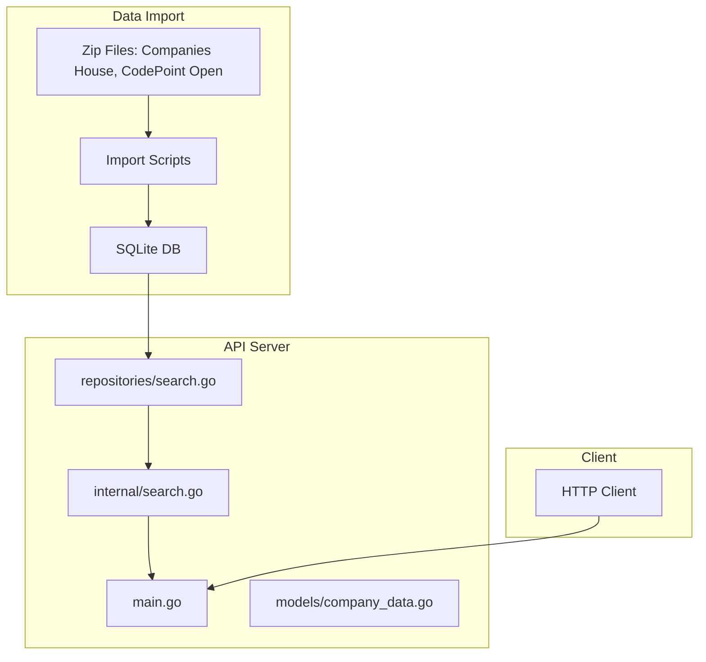

# Company Data API

A fast REST API for querying UK company data by geographic bounding box, built with Go, SQLite, and Gin. It imports official datasets from Companies House and Ordnance Survey CodePoint Open, providing spatial search capabilities for company records.

## Example Usage

#### Search for companies within a bounding box:

```http
GET /v1/company-data/search?bbox=425000,450000,435000,460000
```

#### Group companies by postcode within a bounding box:

```http
GET /v1/company-data/search/by-postcode?bbox=425000,450000,435000,460000
```

#### Health check:

```http
GET /healthz
```

## Architecture Overview



-   **Data Import:**
    -   `internal/company_data.go` and `internal/code_point.go` handle importing zipped CSV data into SQLite.
-   **Database:**
    -   `internal/migration.sql` defines the schema for company and postcode data.
-   **API Server:**
    -   `main.go` sets up the Gin HTTP server, routes, and middleware.
    -   `internal/search.go` implements search endpoints.
    -   `repositories/search.go` performs SQL queries joining company and postcode tables.
-   **Models:**
    -   `models/company_data.go` defines the data structures returned by the API.

## Getting Started Locally

### 1. Download Data

-   Download company data from [Companies House](https://download.companieshouse.gov.uk/en_output.html)
-   Download CodePoint Open from [OS Data Hub](https://osdatahub.os.uk/downloads/open/CodePointOpen)
-   Place both `.zip` files in the `./data` directory (do **not** decompress).

### 2. Build and Run

```sh
go build -tags=jsoniter -o company-data .
./company-data http --db ./data/companies_data.db --port 8080
```

## Using Docker

Build the image:

```sh
docker build -t company-data-api .
```

Run the container (mount your data directory):

```sh
docker run -p 8080:8080 -v $PWD/data:/app/data company-data-api http
```

-   The binary is built with the `jsoniter` tag for fast JSON serialization.
-   The container runs as a non-root user for security.
-   Health checks are enabled on `/healthz`.
-   Timezone and CA certificates are included for compatibility.

## API Endpoints

| Endpoint                                       | Description                                   |
| ---------------------------------------------- | --------------------------------------------- |
| `/v1/company-data/search?bbox=...`             | Search companies within a bounding box        |
| `/v1/company-data/search/by-postcode?bbox=...` | Group companies by postcode in a bounding box |
| `/healthz`                                     | Health check                                  |
| `/metrics`                                     | Prometheus metrics                            |

## Attribution

-   Basic Company Data (UK Gov, Companies House): https://download.companieshouse.gov.uk/en_output
-   CodePoint Open (UK Gov, OS Data Hub): https://osdatahub.os.uk/downloads/open/CodePointOpen

## TODO & Future Enhancements

-   [ ] Add authentication and rate limiting
-   [ ] Support for additional spatial queries (e.g., radius search)
-   [ ] Pagination and filtering options
-   [ ] Docker Compose for easier setup
-   [ ] Automated data refresh/import
-   [ ] OpenAPI/Swagger documentation
-   [ ] More robust error handling and logging
-   [ ] Unit and integration tests for import and API layers

## License

See `LICENSE.md` for further details.
